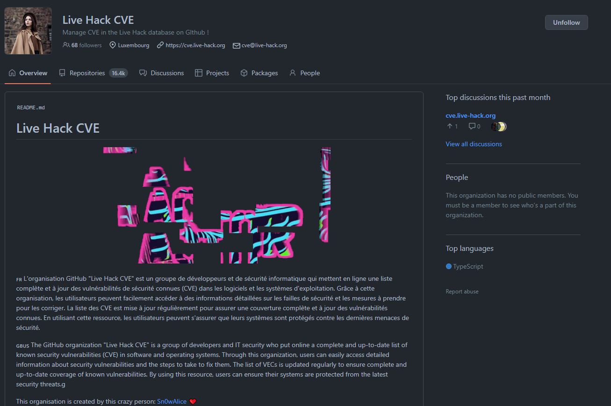
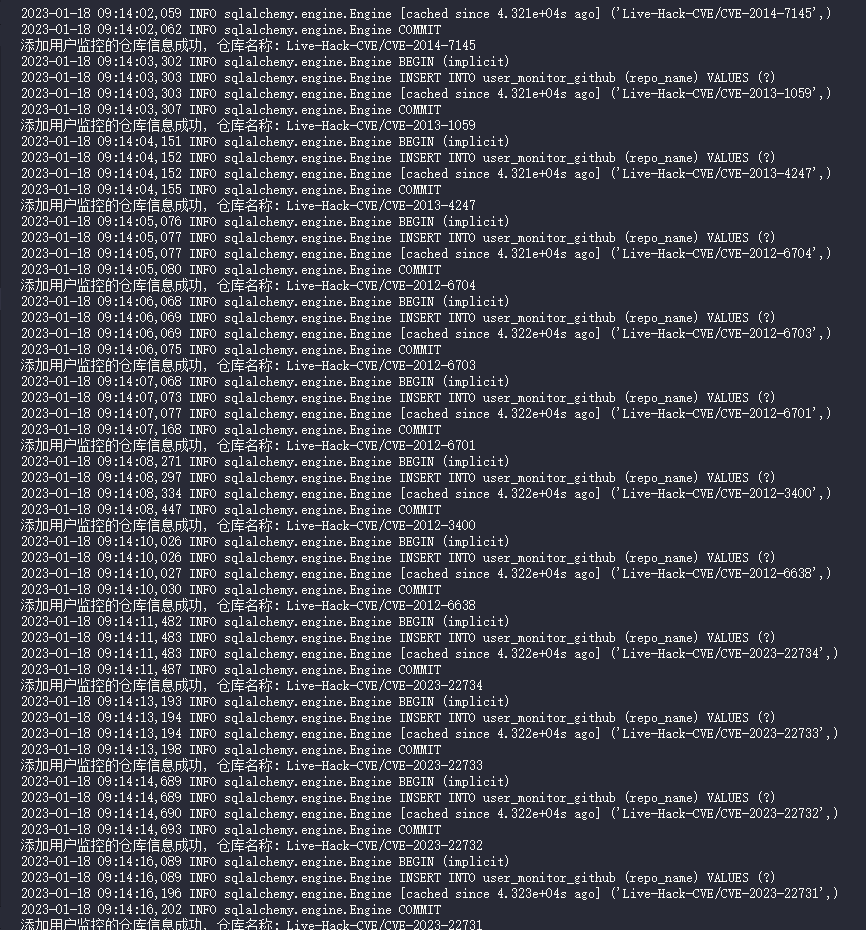

# cve-monitor-wxworkBot

Github-cve监控-指定仓库更新与release监控-指定用户仓库变动监控并推送企微Bot

参考了 [yhy0/github-cve-monitor](https://github.com/yhy0/github-cve-monitor)

最初因为发现没有企微相关的适配器, 而且单个文件代码量比较大因此就手动写了一份

MS漏洞监控部分的内容是 [walex](https://github.com/soy-saber) 写的

---

## 部署说明

>  需要使用 Python 3.6 以上版本运行程序

在仓库根目录下打开命令行安装依赖库, 推荐使用 virtual environment

```bash
pip install virtualenv
virtualenv env -p python3
source env/bin/activate
```

使用 pip 安装依赖

```bash
pip install -r requirements.txt
```

---

### RSS

如果需要支持 RSS 订阅则按照如下方式操作,否则可忽略这一节

修改 `fastapi_server.py` `lin26` `uvicorn.run` 中的 host 与 port 参数为自己想要指定的挂载地址与端口然后运行 `python fastapi_server.py` 以挂载 rss 订阅文件

> 或者使用其他方法挂载亦可

---

### 配置

1、仓库根目录下的 `config.toml.copy` 包含了项目的配置项, 可以复制一份并去掉 `.copy` 后缀作为项目的配置文件, 根据其中注释调整配置即可

2、将 `modules/notify - debug.py` 修改为`notify.py`, 根据场景配置相应的push_config

---

运行程序:

```bash
python main.py
```

---

## TODOLIST

- [ ] 日报周报之类的聚合信息流推送
- [x] 根据 Github 账户的 following, stared 自动生成配置文件
- [ ] 监控其他有利用价值的平台(比如包含poc信息更新的平台)
- [ ] 存个库做增量更新，然后加一个搜索页面
- [ ] 加一个聚合情报的页面做增量更新
  - 本来是想接入 bing 或者 ChatGPT 的, 结果对于正式的接入, 前者没有提供接口, 后者的 api 和 plus 是分开收费的, 而且似乎 api 的收费是按照 token 计费的, 丢太多文字解析起来似乎比较烧钱, 那就算了
  - 后期也许可以考虑使用 cookie 来接入免费版的(不过代理的问题也需要处理)
  - [ ] github上有个聚合情报的库，mx-xn的好像是，不过都是国内厂商的

---

## 目录结构说明 

- `.idea`: PyCharm 配置文件
- `.vscode`: VSCode 配置文件
- `modules`: 项目模块
  - `atk_tools.py`: 红队工具监控模块
  - `cmdb.py`: 数据库操作模块
  - `cve_github.py`: Github CVE 监控模块
  - `cve_MS.py`: MS CVE 监控模块
  - `followed_users.py`: 关注用户仓库变动监控模块, 当该用户新建仓库时, 会推送该仓库的信息
  - `info_push.py`: 信息推送模块
- `README.assets`: README.md 中使用到的图片
- `.gitignore`: git 忽略文件
- `config.toml.copy`: 项目配置文件, 需要删除 `.copy` 后缀并根据其中注释调整配置
- `main.py`: 项目入口文件
- `README.md`: 项目说明文件
- `requirements.txt`: pip 依赖库版本锁定文件  

---

## 一些零碎说明

- Github 的 CVE 监控会有不少是 `Live Hack CVE` 组织的仓库, 而且该组织似乎也在归档往期的 CVE 信息, 因此在关注用户里不用监控该组织的仓库更新以免重复推送相同的仓库更新以及往期的 CVE 信息

  

  

  

---

### 为什么不用 poetry / pdm

poetry 依赖解析比较慢, 用起来似乎不是很舒服

pdm 安装 SQLAlchemy 时依赖解析时间太长了因此没有使用


## 一些模块的注意点

### cve_github.py

- `模块说明`: 使用

在程序试运行了十多天后发现源自 `Live-Hack-CVE` 的 CVE 更新占了大多数, 虽然算是有效信息, 但是由于其高占比导致用户对其他信息的敏感度会降低, 因此选择将其进行打组推送, 以日为单位进行推送

> PS: 需要切一下才能发出来, 不过比较懒狗, 拖了很久一直没切

---

20240612更新

- 根据 Github 账户的 following, stared 自动生成配置文件

  `python get_github_full_names.py`

  原本想直接修改toml文件，但尝试后发现会清除所有注释，改变原文件格式，就改为打印相应值了

- 修改通知组件，使用`notify.py`来引入各类通知接口


